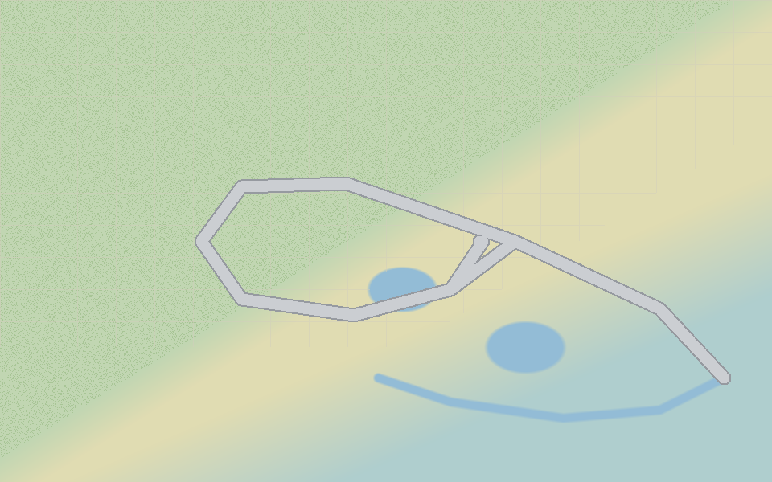

# Civil Engineer AI: Stormwater Review Assistant

Civil Engineer AI is a portfolio GenAI system that assists stormwater and
site-plan review using document evidence, checklist validation, risk flagging,
human review, audit logging, and evaluation tracking.

It is a **review-support and evidence-organization** system for land development
workflows. It is **not** a licensed engineering tool and does not replace
professional engineering judgment.

> **Professional boundary.** Civil Engineer AI assists review. It does not
> approve plans, certify compliance, stamp or seal drawings, replace a licensed
> Professional Engineer, or make final safety determinations. Every finding is a
> review-support issue that needs reviewer confirmation.

---

## Current phase: Phase 10, External Review Response Package

Phase 10 adds an external review response package. It turns the ready-for-handoff
workflow items into a structured draft external response a reviewer can prepare
for an applicant, design engineer, municipal reviewer, or internal review team.
It adds:

- A **response package builder** that generates a Brookside Meadows draft from
  the workflow board, grouping items by topic
- **Draft response wording** per item in plain external-review language, with
  evidence traceability to the workflow item, packet item, and source entities
- **Item and package status management** (item: draft, included, excluded, needs
  revision, reviewer checked; package: draft, needs revision, reviewer checked,
  ready for handoff, archived)
- An **attachment checklist**, a **printable draft response**, a **package
  history**, and a **human review sign-off checklist**
- **Audit events** for generation, viewing, print view, attachments, history,
  and status, draft text, and note changes
- Backend tests for generation, fallback generation, grouping, traceability,
  attachments, status and draft text updates, idempotency, and the safety
  language boundary

Phase 10 keeps the professional boundary: the package is draft external
communication support built from seeded review-support data, not parsed PDF,
DWG, DXF, or Autodesk files, and it does not send email, approve plans, certify
compliance, stamp drawings, verify CAD, validate the design, or make final
engineering decisions. There is no action called approve and no status such as
approved, certified, verified, compliant, or safe. The real workflow runs review
packet, workflow board, response package, then human review, and a licensed
Professional Engineer issues any response outside the system. Live AI calls are
disabled by default, so the project runs without any API key.

Earlier phases established the product foundation:

- Phase 0: research, domain model, and the Brookside Meadows project story
- Phase 1: a static Next.js prototype driven by seed data
- Phase 2: a FastAPI backend, SQLite database, SQLAlchemy models, seeded data,
  API endpoints, tests, and frontend integration
- Phase 3: document chunks, finding sources, and keyword retrieval with
  evidence display
- Phase 4: a controlled AI review run workflow with a mock provider, evidence
  first prompts, strict JSON validation, safety and citation checks, and
  mandatory human review for every draft finding
- Phase 5: a persisted human review queue, reviewer actions with status
  transitions, and evaluation scoring of AI draft findings against the expected
  Brookside Meadows findings
- Phase 6: a plan sheet index, CAD-aware civil feature metadata, plan
  references, missing sheet detection, and plan consistency findings, with Plan
  Sheets and CAD Review pages
- Phase 7: a plan sheet viewer with seeded sheet hotspots, a sheet viewer
  context, and plan consistency review actions
- Phase 8: a review packet builder that assembles documents, checklist items,
  findings, plan sheets, CAD-aware metadata, hotspots, plan consistency
  findings, human review actions, and audit evidence into a structured
  review-support packet draft, with an evidence traceability matrix and a
  printable summary
- Phase 9: a reviewer workflow board that promotes packet items into an
  operational board with triage, follow-up requests, reviewer notes, item
  history, and ready-for-handoff summaries

The reviewed fixture remains **Brookside Meadows**: a 47-lot single-family
subdivision in the Town of Hartwell with a green-and-gray stormwater treatment
train and ten intentionally planted review issues.



---

## Getting started

### Frontend (Next.js)

```bash
npm install
npm run dev        # http://localhost:3000
npm run build
npm run typecheck
```

Set the backend URL for the frontend with an environment variable:

```bash
NEXT_PUBLIC_API_BASE_URL=http://localhost:8000
```

When the backend is reachable, pages render live data from it. When it is not,
they fall back to the local seed data so the app still works. Core project pages
include static fallback data, but Phase 3 source evidence and Phase 4 AI draft
findings are backend-canonical. If the backend is not running, evidence and AI
review panels show a status note instead of duplicated or stale data.

### Backend (FastAPI)

```bash
cd backend
python -m venv .venv
source .venv/bin/activate        # Windows: .venv\Scripts\activate
pip install -r requirements.txt
python -m app.db.seed            # load the Brookside Meadows fixture
uvicorn app.main:app --reload    # http://localhost:8000
pytest
```

See [`backend/README.md`](backend/README.md) for full backend setup and route
examples.

---

## Frontend routes

| Route | Page | Purpose |
| --- | --- | --- |
| `/` | Home | Hero map, metrics, how it works, professional boundary, future modules |
| `/project` | Project dashboard | Brookside Meadows summary, site conditions, improvements, constraints |
| `/documents` | Document library | The seeded submission package with status and planted issues |
| `/checklist` | Stormwater checklist | 19 structured review items with expected statuses |
| `/findings` | Findings | The 10 expected review-support findings |
| `/plan-sheets` | Plan Sheets | The Brookside Meadows plan sheet index with revisions and missing sheet detection |
| `/cad-review` | CAD Review | CAD-aware feature metadata, plan references, and plan consistency findings |
| `/review-packet` | Review Packet | Generate a review-support packet draft, group issues into sections, and view the traceability matrix |
| `/workflow-board` | Workflow Board | Track review-support items through triage, follow-up, and handoff |
| `/response-package` | Response Package | Generate a draft external response package, edit draft wording, and review attachments and sign-off |
| `/ai-review` | AI Review Assistant | Run a controlled AI review and view draft findings and validation failures |
| `/human-review` | Human Review queue | Record reviewer actions and status transitions on draft findings |
| `/audit` | Audit trail | Seeded, traceable review history |
| `/evaluation` | Evaluation dashboard | Score a review run with recall, precision, and citation metrics |

## Backend endpoints

All data routes use the `/api/v1` prefix. Seeded project id:
`proj_brookside_meadows`.

- `GET /health`
- `GET /api/v1/projects` and `GET /api/v1/projects/{project_id}`
- `GET /api/v1/projects/{project_id}/documents` and `GET /api/v1/documents/{document_id}`
- `GET /api/v1/projects/{project_id}/checklist` and `GET /api/v1/checklist/{checklist_item_id}`
- `GET /api/v1/projects/{project_id}/findings` and `GET /api/v1/findings/{finding_id}`
- `GET /api/v1/projects/{project_id}/audit-events`
- `GET /api/v1/evaluation-cases` and `GET /api/v1/projects/{project_id}/evaluation-cases`
- `GET /api/v1/projects/{project_id}/hotspots`
- `GET /api/v1/projects/{project_id}/chunks` and `GET /api/v1/documents/{document_id}/chunks` and `GET /api/v1/chunks/{chunk_id}`
- `GET /api/v1/projects/{project_id}/search?query=...`
- `GET /api/v1/projects/{project_id}/checklist/{checklist_item_id}/evidence`
- `GET /api/v1/projects/{project_id}/findings/{finding_id}/evidence`
- `GET /api/v1/findings/{finding_id}/sources`
- `POST /api/v1/projects/{project_id}/ai-review-runs` and `GET /api/v1/projects/{project_id}/ai-review-runs`
- `GET /api/v1/ai-review-runs/{review_run_id}` and `GET /api/v1/ai-review-runs/{review_run_id}/draft-findings`
- `GET /api/v1/projects/{project_id}/draft-findings` and `GET /api/v1/draft-findings/{draft_finding_id}`
- `GET /api/v1/projects/{project_id}/ai-provider-mode`
- `GET /api/v1/projects/{project_id}/human-review-queue`
- `POST /api/v1/draft-findings/{draft_finding_id}/review-actions` and `GET /api/v1/draft-findings/{draft_finding_id}/review-actions`
- `GET /api/v1/projects/{project_id}/review-actions`
- `POST /api/v1/ai-review-runs/{review_run_id}/evaluate` and `GET /api/v1/ai-review-runs/{review_run_id}/evaluation`
- `GET /api/v1/projects/{project_id}/ai-evaluation-results` and `GET /api/v1/ai-evaluation-results/{evaluation_result_id}`
- `GET /api/v1/projects/{project_id}/plan-sheets` and `GET /api/v1/projects/{project_id}/plan-sheets/summary` and `GET /api/v1/plan-sheets/{sheet_id}`
- `GET /api/v1/projects/{project_id}/cad-metadata` (optional `?entity_type=`) and `GET /api/v1/plan-sheets/{sheet_id}/cad-metadata`
- `GET /api/v1/projects/{project_id}/plan-references` and `GET /api/v1/projects/{project_id}/plan-references/inconsistencies`
- `POST /api/v1/projects/{project_id}/plan-consistency-check` and `GET /api/v1/projects/{project_id}/plan-consistency-findings`
- `GET /api/v1/plan-consistency-findings/{plan_finding_id}`
- `GET /api/v1/projects/{project_id}/sheet-hotspots` and `GET /api/v1/projects/{project_id}/sheet-hotspots/summary`
- `GET /api/v1/plan-sheets/{sheet_id}/sheet-hotspots` and `GET /api/v1/plan-sheets/{sheet_id}/viewer-context` and `GET /api/v1/sheet-hotspots/{hotspot_id}`
- `POST /api/v1/plan-consistency-findings/{plan_finding_id}/review-actions` and `GET /api/v1/plan-consistency-findings/{plan_finding_id}/review-actions`
- `GET /api/v1/projects/{project_id}/plan-consistency-review-actions`
- `POST /api/v1/projects/{project_id}/review-packets/generate` and `GET /api/v1/projects/{project_id}/review-packets`
- `GET /api/v1/review-packets/{packet_id}` and `GET /api/v1/review-packets/{packet_id}/summary`
- `GET /api/v1/review-packets/{packet_id}/traceability` and `GET /api/v1/review-packets/{packet_id}/print-view`
- `POST /api/v1/review-packets/{packet_id}/items/{item_id}/review-actions` and `PATCH /api/v1/review-packets/{packet_id}/items/{item_id}/status`
- `POST /api/v1/projects/{project_id}/workflow-board/generate` and `GET /api/v1/projects/{project_id}/workflow-board`
- `GET /api/v1/projects/{project_id}/workflow-board/summary` and `GET /api/v1/projects/{project_id}/workflow-board/ready-for-handoff`
- `GET /api/v1/workflow-items/{workflow_item_id}` and `GET /api/v1/workflow-items/{workflow_item_id}/history`
- `GET /api/v1/workflow-items/{workflow_item_id}/actions` and `GET /api/v1/workflow-items/{workflow_item_id}/follow-ups`
- `PATCH /api/v1/workflow-items/{workflow_item_id}/status` and `POST /api/v1/workflow-items/{workflow_item_id}/notes` and `POST /api/v1/workflow-items/{workflow_item_id}/follow-ups`
- `POST /api/v1/projects/{project_id}/response-packages/generate` and `GET /api/v1/projects/{project_id}/response-packages`
- `GET /api/v1/response-packages/{response_package_id}` and `GET /api/v1/response-packages/{response_package_id}/summary`
- `GET /api/v1/response-packages/{response_package_id}/print-view` and `GET /api/v1/response-packages/{response_package_id}/attachments` and `GET /api/v1/response-packages/{response_package_id}/history`
- `PATCH /api/v1/response-packages/{response_package_id}/status` and `PATCH /api/v1/response-packages/{response_package_id}/items/{response_item_id}/status`
- `PATCH /api/v1/response-packages/{response_package_id}/items/{response_item_id}/draft-text` and `POST /api/v1/response-packages/{response_package_id}/items/{response_item_id}/notes`

The frontend adds a `/sheet-viewer` page (sheet picker) and a
`/sheet-viewer/{sheetId}` page (the plan sheet viewer with hotspots and review
panels), a `/review-packet` page and a `/review-packet/{packetId}` page (the
review packet builder), a `/workflow-board` page and a
`/workflow-board/{workflowItemId}` page (the reviewer workflow board), and a
`/response-package` page and a `/response-package/{responsePackageId}` page (the
response package builder), alongside the existing `/plan-sheets` and
`/cad-review` pages.

The `GET /api/v1/review-packets/{packet_id}`, `/traceability`, and `/print-view`
endpoints write an audit event recording reviewer access. The workflow item
detail, item history, board summary, and ready-for-handoff endpoints do the
same, as do the response package detail, print view, attachments, and history
endpoints. This read side effect is intentional so the decision history shows
reviewer access.

---

## Project structure

```text
civil-engineer/
  app/              Next.js App Router pages
  components/       Reusable UI components
  data/             TypeScript seed data (frontend fallback)
  lib/              Frontend API client
  public/
    development.png Hero and interactive map base image
  backend/          FastAPI backend, SQLAlchemy models, seed data, tests
  docs/             Phase 0 foundation, hotspot plan, Phase 2 backend notes
```

---

## Tech stack

- **Next.js 14** (App Router) and **React 18**, **TypeScript** (strict)
- **Tailwind CSS**
- **FastAPI**, **Pydantic**, **SQLAlchemy**, **SQLite** for local storage
- **pytest** for backend tests

---

## Documentation

- [`docs/PHASE_0_FOUNDATION.md`](docs/PHASE_0_FOUNDATION.md): product definition and boundaries
- [`docs/BROOKSIDE_MEADOWS_PROJECT_STORY.md`](docs/BROOKSIDE_MEADOWS_PROJECT_STORY.md): the review fixture
- [`docs/DOMAIN_MODEL.md`](docs/DOMAIN_MODEL.md): core entities and ER diagram
- [`docs/V1_SCOPE.md`](docs/V1_SCOPE.md): in and out of scope and success criteria
- [`docs/ROADMAP.md`](docs/ROADMAP.md): staged path from foundation to platform
- [`docs/SEED_DATA_PLAN.md`](docs/SEED_DATA_PLAN.md): seed-ready data
- [`docs/HOMEPAGE_HOTSPOT_PLAN.md`](docs/HOMEPAGE_HOTSPOT_PLAN.md): interactive map plan
- [`docs/PHASE_2_BACKEND_DATA_MODEL.md`](docs/PHASE_2_BACKEND_DATA_MODEL.md): Phase 2 backend and data model
- [`docs/PHASE_3_RETRIEVAL_FOUNDATION.md`](docs/PHASE_3_RETRIEVAL_FOUNDATION.md): Phase 3 evidence and retrieval
- [`docs/PHASE_4_AI_REVIEW_ASSISTANT.md`](docs/PHASE_4_AI_REVIEW_ASSISTANT.md): Phase 4 AI review workflow
- [`docs/PHASE_5_HUMAN_REVIEW_AND_EVALUATION.md`](docs/PHASE_5_HUMAN_REVIEW_AND_EVALUATION.md): Phase 5 human review and evaluation scoring
- [`docs/PHASE_6_PLAN_SHEET_CAD_FOUNDATION.md`](docs/PHASE_6_PLAN_SHEET_CAD_FOUNDATION.md): Phase 6 plan sheet and CAD-aware review foundation
- [`docs/PHASE_7_PLAN_SHEET_VIEWER.md`](docs/PHASE_7_PLAN_SHEET_VIEWER.md): Phase 7 plan sheet viewer and sheet hotspot review
- [`docs/PHASE_8_REVIEW_PACKET_BUILDER.md`](docs/PHASE_8_REVIEW_PACKET_BUILDER.md): Phase 8 review packet builder and evidence traceability
- [`docs/PHASE_9_WORKFLOW_BOARD.md`](docs/PHASE_9_WORKFLOW_BOARD.md): Phase 9 reviewer workflow board and issue resolution tracking
- [`docs/PHASE_10_RESPONSE_PACKAGE.md`](docs/PHASE_10_RESPONSE_PACKAGE.md): Phase 10 external review response package
- [`docs/CAD_INTEGRATION_ROADMAP.md`](docs/CAD_INTEGRATION_ROADMAP.md): staged CAD integration path
- [`docs/ARCHITECTURE.md`](docs/ARCHITECTURE.md): system architecture
- [`docs/RESEARCH_AND_SYSTEM_DESIGN.md`](docs/RESEARCH_AND_SYSTEM_DESIGN.md): research basis

---

## What Phase 10 proves

- The product can translate internal findings into outward communication: a
  reviewer turns ready-for-handoff workflow items into a structured draft
  external response grouped by topic, with plain review-support wording.
- The full review desk loop is in place: review packet, workflow board, response
  package, then human review, with the system never issuing the response itself.
- Traceability is preserved end to end: each response item links back to its
  workflow item, packet item, and source evidence.
- The professional boundary holds: the package is draft external communication
  support built from seeded review-support data, and it does not send email,
  approve plans, certify compliance, verify CAD, or validate the design. There
  is no action called approve.
- The decision history is preserved: generation, viewing, print view,
  attachments, history, and status, draft text, and note changes all write audit
  events.

## What comes next

- A later phase could let a reviewer choose the audience and a subset of items,
  export the printable draft to a file, and track response revisions over time,
  and could begin reading real CAD-derived metadata. Real CAD-derived metadata
  extraction remains a separate, later track.

See [`docs/ROADMAP.md`](docs/ROADMAP.md) and
[`docs/CAD_INTEGRATION_ROADMAP.md`](docs/CAD_INTEGRATION_ROADMAP.md) for the full
plan.
