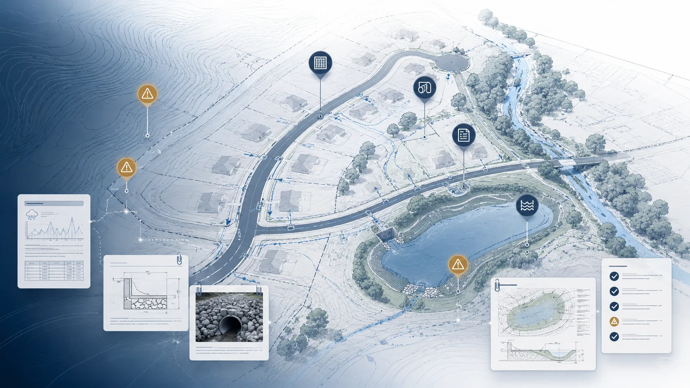

<div align="center">

# Civil Engineer AI

### Stormwater Review Assistant

**Evidence-first review workflows for civil engineering submissions, DXF intake, document traceability, findings, resubmittals, and reviewer-controlled handoff.**

[](https://civil-engineer.up.railway.app/)
[](https://civil-engineer.up.railway.app/proof-of-concept)
[](https://github.com/mpalmer79/civil-engineer/actions/workflows/ci.yml)



<br />

[](https://github.com/mpalmer79/civil-engineer)
[](https://linkedin.com/in/mpalmer1234)

</div>

## Product overview

Civil Engineer AI is a full-stack stormwater review-support platform for civil engineering and AEC workflows. It brings project intake, submitted documents, CAD metadata, evidence citations, checklist review, findings, applicant responses, resubmittals, revision comparison, response packages, and audit history into one controlled review environment.

The platform is designed for civil engineering firms, municipal review teams, internal quality-assurance reviewers, and project managers who need a defensible record of how a submission was reviewed and how each concern moved from source evidence to final handoff.

Civil Engineer AI supports professional judgment. It does not approve plans, certify compliance, stamp drawings, validate engineering design, or replace a licensed Professional Engineer.

## Business value

Traditional plan review often spreads critical information across drawings, PDFs, spreadsheets, email threads, checklists, and reviewer notes. Civil Engineer AI creates a connected project record that helps teams:

- Trace findings back to source documents, pages, sheets, and evidence.
- Process DXF submissions through a repeatable intake and metadata extraction workflow.
- Apply reusable stormwater review checklists and rule packs.
- Track applicant responses and unresolved concerns across review rounds.
- Compare resubmittals and document revision history.
- Assemble reviewer-controlled response packages and review packets.
- Maintain role-based access, organization boundaries, and project audit history.
- Improve consistency without transferring engineering authority to automation.

## Core platform capabilities

| Capability | Implementation |
|---|---|
| Project and organization management | Authenticated workspaces, organization membership, project access controls, team administration, and invitations |
| Document intake | Project document registration, file storage abstraction, PDF text extraction, page indexing, and page-level evidence citations |
| CAD and DXF intake | Browser upload, file validation, `ezdxf` parsing, metadata extraction, layer analysis, and reproducible validation artifacts |
| Evidence retrieval | Deterministic search, filtering, ranking, evidence candidates, citations, and traceability views |
| Review management | Reusable rule packs, project checklists, checklist items, findings, human review, and evaluation workflows |
| Review cycles | Applicant response matrices, resubmittal rounds, revision comparisons, workflow boards, and workload views |
| Deliverables | Review packets, response packages, previews, comment-letter drafts, and reviewer-controlled handoff |
| Governance | Audit events, safety vocabulary, authentication, authorization, CSRF protection, diagnostics, and deployment readiness |
| Operations | Health and readiness checks, environment validation, pilot administration, billing surfaces, and deployment verification |

## Reference project

Brookside Meadows is a synthetic subdivision dataset used to demonstrate and regression-test the complete workflow. It provides a stable reference project with documents, plan sheets, DXF content, checklist items, findings, evidence, applicant responses, review cycles, and generated artifacts.

The reference project is intentionally fictional. It is used for product evaluation, technical validation, training, automated testing, and reproducibility. It is not a real municipal submission or engineering approval.

Recommended evaluation path:

1. [Open the technical overview](https://civil-engineer.up.railway.app/start-here)
2. [Run the guided product tour](https://civil-engineer.up.railway.app/guided-demo)
3. [Review the reproducible DXF validation](https://civil-engineer.up.railway.app/proof-of-concept)
4. [Inspect deployment status](https://civil-engineer.up.railway.app/deployment-status)
5. [Request a controlled pilot](https://civil-engineer.up.railway.app/pilot)

## Architecture

Civil Engineer AI uses a service-oriented web architecture with a Next.js frontend and FastAPI backend.

```text
Browser
  |
  | Same-origin requests and HttpOnly session cookie
  v
Next.js App Router
  |
  | Backend-for-frontend proxy
  v
FastAPI API
  |
  +-- SQLAlchemy domain models
  +-- Alembic migrations
  +-- PostgreSQL production database
  +-- SQLite local and test database
  +-- File storage provider abstraction
  +-- pypdf document extraction
  +-- ezdxf CAD parsing
  +-- Audit, access-control, and safety services
```

The frontend uses TypeScript, React, Tailwind CSS, generated OpenAPI types, Vitest, Playwright, and Axe accessibility checks. The backend uses Python, FastAPI, Pydantic, SQLAlchemy, Alembic, PostgreSQL, `pypdf`, and `ezdxf`.

Authenticated browser requests are routed through a same-origin backend-for-frontend layer. Session tokens remain server-side in HttpOnly cookies, and mutating requests are protected by origin and CSRF controls. Authorization is enforced at organization and project boundaries.

## Engineering decision boundary

Civil Engineer AI is deliberately reviewer-controlled.

The platform can organize documents, extract metadata, retrieve evidence, draft review-support findings, compare revisions, and prepare communication packages. Final interpretation, code applicability, design acceptance, safety determination, and professional approval remain with qualified human reviewers.

The repository reinforces this boundary through backend safety vocabulary, frontend content checks, test coverage, and product language that avoids autonomous approval claims.

## Technical validation and quality gates

The CI pipeline includes independent gates for:

- Frontend type checking and linting
- Frontend unit tests and coverage thresholds
- Backend tests with a 90 percent coverage floor
- Production builds
- Alembic migration-head validation
- FastAPI application import validation
- OpenAPI contract and generated TypeScript freshness
- Content integrity and guide-knowledge checks
- Production dependency auditing
- Deterministic DXF proof generation and artifact comparison
- Playwright browser tests
- Axe accessibility checks

The DXF validation harness generates a structurally valid synthetic subdivision drawing, uploads it through the real API, parses it with the production CAD-intake path, compares the result with versioned ground truth, and verifies published artifacts and hashes.

## Local development

### Prerequisites

- Node.js 22 or newer
- Python 3.12
- npm
- A PostgreSQL database for production-like development, or SQLite for local evaluation

### Frontend

```text
npm ci
npm run dev
```

The frontend is available at `http://localhost:3000`.

### Backend

From the `backend` directory:

```text
python -m pip install -r requirements.txt
python -m uvicorn app.main:app --reload
```

The API is available at `http://localhost:8000`.

Set the frontend environment variable to the backend origin without an `/api/v1` suffix:

```text
NEXT_PUBLIC_API_BASE_URL=http://localhost:8000
```

Use the repository environment examples and deployment documentation for authentication, storage, database, email, billing, and production settings.

## Validation commands

```text
npm run typecheck
npm run lint
npm run check:content
npm run check:guide
npm run test:coverage
npm run build
```

From the `backend` directory:

```text
python -m pytest --cov=app --cov-report=term-missing --cov-fail-under=90
```

Additional release gates are defined in `.github/workflows/ci.yml`.

## Deployment

The current deployment targets Railway with separate frontend and backend services.

The frontend requires the backend service origin:

```text
NEXT_PUBLIC_API_BASE_URL=https://your-backend-service.up.railway.app
```

Operational verification surfaces include:

- `/health`
- `/api/v1/diagnostics/readiness`
- `/deployment-status`

Production deployment requires a managed PostgreSQL database, secure secrets, durable file storage, configured CORS and cookie settings, and validated environment configuration.

## Repository map

```text
app/                  Next.js routes, layouts, public pages, workspaces, and BFF routes
backend/app/          FastAPI application, API routes, services, models, and schemas
components/           Shared and domain-specific React components
lib/                  API clients, authentication, generated contracts, and shared logic
data/                 Reference-project and frontend fixture data
public/               Static media and downloadable public artifacts
scripts/              Contract generation, validation, release, and proof harnesses
e2e/                  Playwright end-to-end and accessibility tests
docs/                 Product, architecture, security, deployment, and technical records
.github/workflows/     CI and release quality gates
```

## Documentation

The current repository contains detailed engineering records covering the platform’s development history and individual backend capabilities. The most useful entry points are:

- [Architecture](docs/ARCHITECTURE.md)
- [Domain model](docs/DOMAIN_MODEL.md)
- [Route architecture](docs/ROUTE_ARCHITECTURE.md)
- [Authentication and access control](docs/AUTHENTICATION_AND_ACCESS_CONTROL.md)
- [Security and professional boundary](docs/SECURITY_AND_PROFESSIONAL_BOUNDARY.md)
- [Tenant isolation audit](docs/TENANT_ISOLATION_AUDIT.md)
- [Production database](docs/PRODUCTION_DATABASE.md)
- [Railway deployment guide](docs/RAILWAY_DEPLOYMENT_GUIDE.md)
- [Release readiness](docs/RELEASE_READINESS.md)
- [DXF proof of concept](docs/proof-of-concept/DXF_PROOF_OF_CONCEPT.md)
- [DXF test methodology](docs/proof-of-concept/DXF_TEST_METHODOLOGY.md)
- [Brookside Meadows project story](docs/BROOKSIDE_MEADOWS_PROJECT_STORY.md)
- [Real versus mocked behavior](docs/real-vs-mocked.md)
- [Roadmap](docs/ROADMAP.md)
- [Full documentation index](docs/README.md)

## Current limitations

The current platform does not provide:

- DWG parsing
- Native Autodesk Civil 3D integration
- GIS integration
- OCR for image-only documents
- Computer-vision interpretation of plan graphics
- External vector-search infrastructure
- Enterprise single sign-on
- A complete applicant-facing portal
- Autonomous engineering approval or compliance certification

Live generative-AI calls remain disabled by default. The system’s strongest implemented capabilities are deterministic document indexing, evidence traceability, DXF metadata extraction, structured review workflows, and reviewer-controlled deliverables.

## Product direction

The next maturity phase should focus on enterprise integration, operational resilience, configurable jurisdictional rule packs, background processing for large file workloads, richer provenance, production observability, and controlled design-partner pilots.

The platform should continue to prioritize auditability, human authority, deterministic validation, and domain-specific workflow depth over broad but unverifiable automation claims.

---

<div align="center">

**Civil Engineer AI · Stormwater Review Assistant**

[](https://github.com/mpalmer79/civil-engineer)
[](https://linkedin.com/in/mpalmer1234)

[Live Platform](https://civil-engineer.up.railway.app/) · [Technical Overview](https://civil-engineer.up.railway.app/start-here) · [Guided Product Tour](https://civil-engineer.up.railway.app/guided-demo) · [DXF Validation](https://civil-engineer.up.railway.app/proof-of-concept)

</div>
