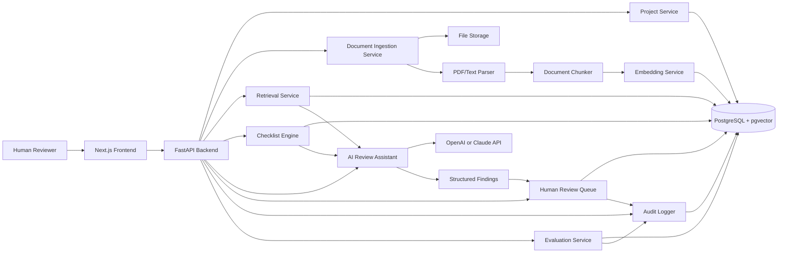
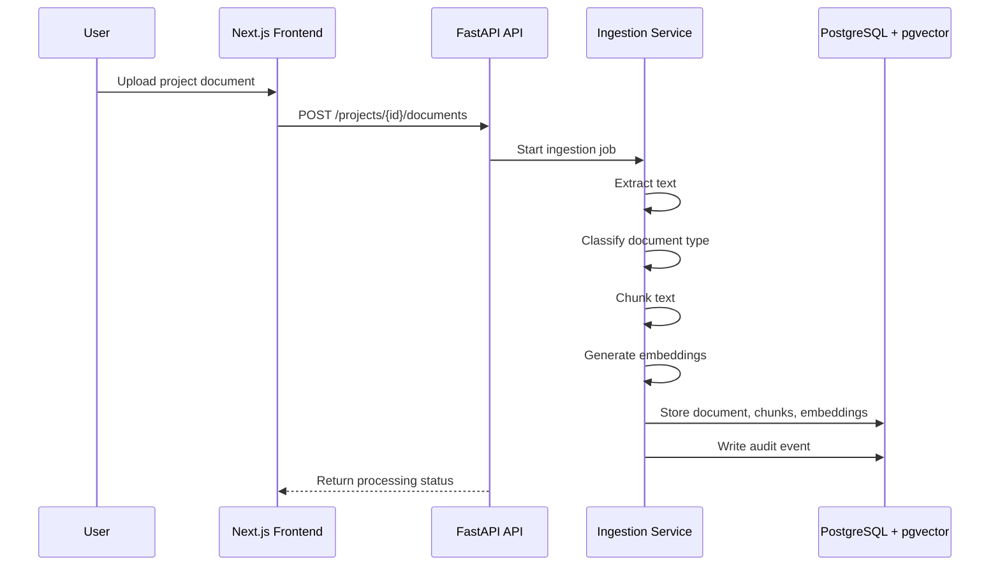
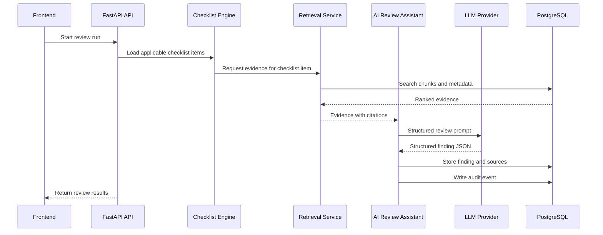
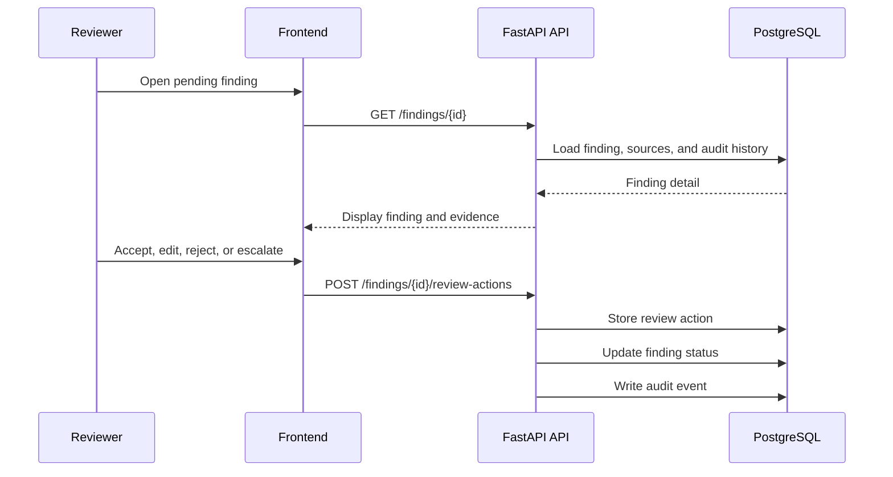
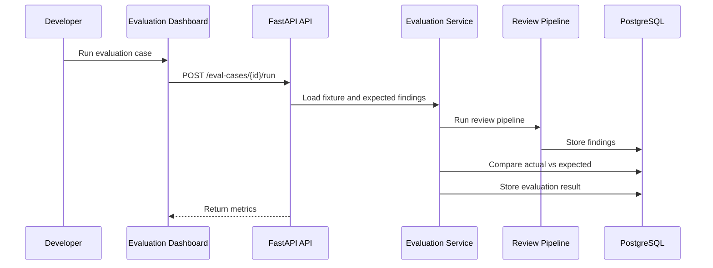

# CivilSite AI: Stormwater Review Assistant Architecture

CivilSite AI: Stormwater Review Assistant is a portfolio GenAI system designed to assist with stormwater and site-plan document review. The system is not a licensed engineering tool. It does not approve plans, certify compliance, stamp drawings, replace a Professional Engineer, or make final public safety determinations.

The goal of this architecture is to show a realistic production-style GenAI system. CivilSite AI combines structured project data, document retrieval, checklist validation, risk flagging, human review, audit logging, and evaluation tracking.

This project is stored in the `civil-engineer` repository, but the product name is **CivilSite AI: Stormwater Review Assistant**.

---

## 1. Architecture Goals

CivilSite AI is designed around the following goals:

1. Ingest stormwater and site-plan review documents.
2. Extract useful text and metadata from uploaded files.
3. Store document chunks in a searchable format.
4. Use retrieval-augmented generation to answer review questions from source documents.
5. Apply a structured stormwater review checklist.
6. Flag missing, unclear, or conflicting information.
7. Route AI-generated findings to a human reviewer.
8. Preserve a full audit trail of system actions.
9. Evaluate the system using expected findings and reviewer feedback.

The system should feel like an early production GenAI review-support platform, not a basic chatbot.

---

## 2. Professional Boundary

CivilSite AI supports human review. It does not make final engineering decisions.

The system must not:

- Approve engineering plans
- Certify compliance
- Stamp or seal drawings
- Replace a licensed Professional Engineer
- Make final safety determinations
- Claim that a design is safe
- Claim that a project is compliant without human confirmation

The system should use careful language such as:

- Potential issue
- Requires reviewer confirmation
- Missing evidence
- Conflicting information
- Based on uploaded documents
- Recommended follow-up
- Needs human review

The system should avoid final decision language such as:

- Approved
- Certified
- Compliant
- Safe
- Engineer-confirmed
- Passes review
- Meets all requirements

This boundary is part of the architecture. It affects prompts, database statuses, UI labels, audit records, and evaluation tests.

---

## 3. High-Level System Overview

CivilSite AI uses a frontend, backend, database, vector search layer, AI provider, human review workflow, and evaluation service.



---

## 4. Recommended Technology Stack

### Frontend

Use **Next.js with TypeScript**.

The frontend should provide:

- Project dashboard
- Document library
- Review workspace
- Checklist view
- Finding detail pages
- Human review queue
- Audit log
- Evaluation dashboard

Next.js is a good fit because the project needs a clean portfolio UI, page-based navigation, API integration, and reusable components.

---

### Backend

Use **FastAPI with Python**.

The backend should provide:

- REST API endpoints
- File upload handling
- Document processing workflows
- Retrieval orchestration
- Checklist evaluation
- AI review requests
- Human review actions
- Audit logging
- Evaluation runs

FastAPI is a strong fit because this system uses Python-based document processing, embedding calls, AI provider calls, structured JSON validation, and background-style workflows.

---

### Database

Use **PostgreSQL with pgvector**.

The database should store:

- Projects
- Documents
- Document chunks
- Embeddings
- Checklist items
- Project checklist statuses
- Review runs
- Findings
- Finding sources
- Human review actions
- Audit events
- Evaluation cases
- Evaluation results

Using PostgreSQL keeps the architecture simple and realistic. pgvector allows semantic search without requiring a separate vector database for v1.

---

### AI Provider

Use **OpenAI or Claude API**.

The AI model should be used for:

- Source-linked document summaries
- Checklist evidence comparison
- Risk flag drafting
- Review memo drafting
- RFI or follow-up language
- Structured finding generation

The AI model should not be trusted as the only decision-maker. Model outputs must be limited by retrieved evidence, checklist rules, structured schemas, safety wording checks, and human review.

---

## 5. Main System Modules

---

## 5.1 Project Service

The Project Service manages the main stormwater review workspace.

Responsibilities:

- Create projects
- Store project metadata
- Track project status
- Track review type
- Track jurisdiction
- Link documents to projects
- Link checklist items to projects
- Link findings to projects
- Track review progress

Example project statuses:

- `intake`
- `documents_uploaded`
- `documents_processing`
- `ready_for_review`
- `ai_review_running`
- `human_review_required`
- `comments_issued`
- `revised_documents_submitted`
- `closed`

Example project metadata:

```json
{
  "project_id": "proj_001",
  "project_name": "Cedar Ridge Commercial Redevelopment",
  "project_type": "commercial_redevelopment",
  "jurisdiction": "Mock Municipality",
  "review_type": "post_construction_stormwater",
  "site_area_acres": 4.8,
  "disturbed_area_acres": 2.1,
  "has_infiltration_practice": true,
  "has_detention_basin": true,
  "status": "ready_for_review"
}
```

---

## 5.2 Document Ingestion Service

The Document Ingestion Service converts uploaded files into searchable project evidence.

Responsibilities:

- Accept PDF and text uploads
- Store file metadata
- Extract text from documents
- Classify document type
- Split text into chunks
- Generate embeddings
- Store chunks and embeddings
- Preserve page and section references
- Log ingestion events

Supported v1 document types:

- Site plan narrative
- Drainage report
- Stormwater management report
- Hydrology calculations
- Hydraulic calculations
- Soil report
- Infiltration testing documentation
- Erosion and sediment control plan
- SWPPP
- Operation and maintenance plan
- Inspection notes
- RFI log
- Permit checklist
- Municipal design standard excerpt
- Construction specifications

Example document record:

```json
{
  "document_id": "doc_001",
  "project_id": "proj_001",
  "file_name": "drainage-report.pdf",
  "document_type": "drainage_report",
  "revision": "initial",
  "uploaded_by": "reviewer",
  "processing_status": "processed"
}
```

---

## 5.3 Document Chunking

Documents should be split into smaller searchable sections.

Each chunk should preserve enough metadata to support source-linked review.

Recommended chunk fields:

- Project ID
- Document ID
- File name
- Document type
- Page number
- Section heading
- Chunk index
- Chunk text
- Embedding vector
- Token count
- Created timestamp

Example chunk record:

```json
{
  "chunk_id": "chunk_0042",
  "project_id": "proj_001",
  "document_id": "doc_001",
  "file_name": "drainage-report.pdf",
  "document_type": "drainage_report",
  "page_number": 7,
  "section_heading": "Proposed Drainage Conditions",
  "chunk_index": 42,
  "chunk_text": "The proposed condition analysis uses the 25-year, 24-hour storm event."
}
```

Chunking should prioritize traceability. The reviewer should be able to inspect where every AI-supported statement came from.

---

## 5.4 Retrieval Service

The Retrieval Service finds relevant evidence from uploaded project documents and reference materials.

Responsibilities:

- Receive a review question or checklist item
- Search document chunks
- Search by semantic similarity
- Search by keywords
- Return ranked evidence
- Preserve document and page references
- Reject weak retrieval results
- Pass source evidence to the AI Review Assistant

Retrieval should combine:

- Vector similarity search
- Keyword search
- Document type filters
- Checklist category filters
- Page and section metadata

Example retrieval request:

```json
{
  "project_id": "proj_001",
  "query": "Does the project include infiltration testing evidence for the proposed infiltration basin?",
  "document_types": [
    "soil_report",
    "infiltration_testing_documentation",
    "stormwater_management_report"
  ],
  "limit": 8
}
```

Example retrieval result:

```json
{
  "results": [
    {
      "chunk_id": "chunk_0117",
      "document_id": "doc_004",
      "file_name": "geotechnical-report.pdf",
      "page_number": 3,
      "section_heading": "Infiltration Testing",
      "score": 0.84,
      "text_excerpt": "No field infiltration testing was performed at the proposed basin location."
    }
  ]
}
```

---

## 5.5 Checklist Engine

The Checklist Engine stores structured stormwater review requirements and determines which items apply to a project.

This is one of the most important parts of the architecture. The system should not depend on a chatbot-style prompt to decide what matters. The checklist provides structure.

Responsibilities:

- Store reusable checklist items
- Determine applicability based on project metadata
- Identify expected evidence
- Identify supporting document types
- Trigger retrieval tasks
- Track checklist status
- Connect findings to checklist items

Checklist item statuses:

- `not_started`
- `supported`
- `missing`
- `conflicting`
- `unclear`
- `not_applicable`
- `requires_human_review`

Example checklist item:

```json
{
  "checklist_item_id": "chk_006",
  "category": "infiltration",
  "requirement": "If an infiltration practice is proposed, the package should include geotechnical evidence and infiltration testing documentation.",
  "applies_when": {
    "has_infiltration_practice": true
  },
  "expected_evidence": [
    "soil_report",
    "infiltration_testing_documentation",
    "groundwater_depth",
    "seasonal_high_groundwater"
  ],
  "supporting_document_types": [
    "soil_report",
    "infiltration_testing_documentation",
    "stormwater_management_report"
  ],
  "risk_level": "high"
}
```

---

## 5.6 AI Review Assistant

The AI Review Assistant generates structured review-support findings using retrieved evidence and checklist context.

Responsibilities:

- Summarize relevant evidence
- Compare evidence against checklist items
- Identify missing information
- Identify conflicting information
- Draft reviewer-facing comments
- Draft follow-up or RFI language
- Assign confidence levels
- Mark uncertain items for human review
- Cite retrieved source chunks

The AI Review Assistant should return structured JSON, not uncontrolled paragraphs.

Example AI finding schema:

```json
{
  "finding_type": "missing_evidence",
  "checklist_item_id": "chk_006",
  "title": "Infiltration testing evidence not found",
  "summary": "The uploaded package proposes an infiltration basin, but the retrieved documents do not show field infiltration testing results for the proposed basin location.",
  "status": "requires_human_review",
  "risk_level": "high",
  "confidence": 0.78,
  "source_references": [
    {
      "document_id": "doc_004",
      "file_name": "geotechnical-report.pdf",
      "page_number": 3,
      "chunk_id": "chunk_0117"
    }
  ],
  "recommended_reviewer_action": "Confirm whether infiltration testing was submitted separately. If not, request supporting field testing documentation from the applicant.",
  "safety_boundary_check": {
    "does_not_approve_plan": true,
    "does_not_certify_compliance": true,
    "requires_human_confirmation": true
  }
}
```

Allowed finding classifications:

- `supported`
- `missing`
- `conflicting`
- `unclear`
- `not_applicable`
- `requires_human_review`

The AI should never produce final decision statuses such as `approved`, `certified`, or `compliant`.

---

## 5.7 Risk Flagging Service

The Risk Flagging Service converts checklist results and retrieved evidence into reviewer-facing alerts.

V1 risk categories:

- Missing drainage calculations
- Mismatched storm event assumptions
- Missing erosion and sediment control details
- Missing infiltration testing
- Missing soil or groundwater information
- Unclear outfall information
- Missing O&M responsibility
- Missing maintenance access
- Unresolved RFI
- Inspection note without corrective action
- Conflicting document references
- Missing revised plan response

Risk levels:

- `low`
- `medium`
- `high`

Example risk flag:

```json
{
  "finding_id": "find_021",
  "risk_category": "missing_infiltration_testing",
  "risk_level": "high",
  "reason": "The project metadata indicates an infiltration practice, but the system did not find supporting infiltration testing documentation.",
  "review_status": "pending"
}
```

---

## 5.8 Human Review Queue

The Human Review Queue ensures that AI findings are reviewed by a person before they are accepted.

Responsibilities:

- Display AI-generated findings
- Show source references
- Show confidence levels
- Show risk levels
- Allow reviewer decisions
- Capture reviewer comments
- Track unresolved issues
- Escalate high-risk findings

Reviewer actions:

- `accepted`
- `edited`
- `rejected`
- `escalated`
- `marked_unclear`
- `requested_more_information`

Example review action:

```json
{
  "review_action_id": "act_014",
  "finding_id": "find_021",
  "reviewer_id": "user_001",
  "action": "accepted",
  "reviewer_note": "Valid issue. Applicant should provide infiltration testing results or revise the proposed stormwater control measure.",
  "created_at": "2026-06-22T18:00:00Z"
}
```

---

## 5.9 Audit Logger

The Audit Logger records important system actions.

Responsibilities:

- Log project creation
- Log document uploads
- Log document processing
- Log retrieval requests
- Log model calls
- Log prompt versions
- Log generated findings
- Log human review actions
- Log evaluation runs
- Log errors and failures

The audit trail should help answer:

- What document was used?
- What checklist item was evaluated?
- What evidence was retrieved?
- What did the AI generate?
- What did the human reviewer decide?
- What changed after review?

Example audit event:

```json
{
  "audit_event_id": "audit_083",
  "project_id": "proj_001",
  "event_type": "finding_generated",
  "actor_type": "system",
  "entity_type": "finding",
  "entity_id": "find_021",
  "metadata": {
    "model_provider": "openai_or_claude",
    "model_name": "selected_model_name",
    "prompt_version": "review_finding_v1",
    "retrieved_chunk_ids": ["chunk_0117", "chunk_0142"],
    "checklist_item_id": "chk_006"
  },
  "created_at": "2026-06-22T18:00:00Z"
}
```

---

## 5.10 Evaluation Service

The Evaluation Service proves that the GenAI workflow is being tested.

Responsibilities:

- Store evaluation cases
- Store expected findings
- Run the review pipeline against mock project packages
- Compare actual findings against expected findings
- Track false positives
- Track false negatives
- Track source citation accuracy
- Track unsupported claims
- Track reviewer approval and rejection rates
- Display metrics in an evaluation dashboard

Core evaluation metrics:

- Checklist recall
- Checklist precision
- Source citation accuracy
- False positive count
- False negative count
- Reviewer approval rate
- Reviewer rejection rate
- Unresolved risk count
- Unsupported claim count
- Response quality score

Example evaluation case:

```json
{
  "eval_case_id": "eval_003",
  "name": "Missing infiltration testing evidence",
  "project_fixture": "mock_infiltration_missing_testing",
  "expected_findings": [
    {
      "checklist_item_id": "chk_006",
      "expected_status": "missing",
      "expected_risk_level": "high"
    }
  ]
}
```

Example evaluation result:

```json
{
  "eval_result_id": "eval_result_019",
  "eval_case_id": "eval_003",
  "review_run_id": "run_042",
  "checklist_recall": 0.91,
  "checklist_precision": 0.86,
  "source_citation_accuracy": 0.88,
  "false_positives": 1,
  "false_negatives": 0,
  "unsupported_claims": 0
}
```

---

## 6. Main Data Model

The v1 database should include the following tables.

---

## 6.1 projects

Stores project-level metadata.

Important fields:

- `id`
- `name`
- `project_type`
- `jurisdiction`
- `review_type`
- `status`
- `site_area_acres`
- `disturbed_area_acres`
- `has_infiltration_practice`
- `has_detention_basin`
- `created_at`
- `updated_at`

---

## 6.2 documents

Stores uploaded document metadata.

Important fields:

- `id`
- `project_id`
- `file_name`
- `document_type`
- `revision`
- `storage_path`
- `processing_status`
- `uploaded_by`
- `created_at`

---

## 6.3 document_chunks

Stores extracted text chunks and embeddings.

Important fields:

- `id`
- `project_id`
- `document_id`
- `chunk_index`
- `page_number`
- `section_heading`
- `content`
- `embedding`
- `created_at`

---

## 6.4 checklist_items

Stores reusable review checklist requirements.

Important fields:

- `id`
- `category`
- `requirement`
- `applies_when`
- `expected_document_types`
- `expected_evidence`
- `risk_level`
- `created_at`

---

## 6.5 project_checklist_items

Stores checklist status for a specific project.

Important fields:

- `id`
- `project_id`
- `checklist_item_id`
- `status`
- `assigned_reviewer_id`
- `updated_at`

---

## 6.6 review_runs

Stores each AI-assisted review run.

Important fields:

- `id`
- `project_id`
- `run_type`
- `status`
- `model_provider`
- `model_name`
- `prompt_version`
- `started_at`
- `completed_at`

---

## 6.7 findings

Stores AI-generated review findings.

Important fields:

- `id`
- `project_id`
- `review_run_id`
- `checklist_item_id`
- `finding_type`
- `title`
- `summary`
- `risk_level`
- `confidence`
- `status`
- `recommended_action`
- `created_at`

---

## 6.8 finding_sources

Stores source evidence for findings.

Important fields:

- `id`
- `finding_id`
- `document_id`
- `chunk_id`
- `page_number`
- `excerpt`
- `created_at`

---

## 6.9 review_actions

Stores human reviewer decisions.

Important fields:

- `id`
- `finding_id`
- `reviewer_id`
- `action`
- `reviewer_note`
- `created_at`

---

## 6.10 audit_events

Stores traceability records.

Important fields:

- `id`
- `project_id`
- `event_type`
- `actor_type`
- `entity_type`
- `entity_id`
- `metadata`
- `created_at`

---

## 6.11 eval_cases

Stores evaluation fixtures.

Important fields:

- `id`
- `name`
- `description`
- `project_fixture`
- `expected_findings`
- `created_at`

---

## 6.12 eval_results

Stores evaluation run results.

Important fields:

- `id`
- `eval_case_id`
- `review_run_id`
- `checklist_recall`
- `checklist_precision`
- `source_citation_accuracy`
- `false_positives`
- `false_negatives`
- `unsupported_claims`
- `created_at`

---

## 7. Main System Flows

---

## 7.1 Document Ingestion Flow



---

## 7.2 AI Review Flow



---

## 7.3 Human Review Flow



---

## 7.4 Evaluation Flow



---

## 8. API Surface

The v1 API should be simple and readable.

---

## 8.1 Projects

- `GET /projects`
- `POST /projects`
- `GET /projects/{project_id}`
- `PATCH /projects/{project_id}`

---

## 8.2 Documents

- `GET /projects/{project_id}/documents`
- `POST /projects/{project_id}/documents`
- `GET /documents/{document_id}`
- `GET /documents/{document_id}/chunks`

---

## 8.3 Checklist

- `GET /projects/{project_id}/checklist`
- `POST /projects/{project_id}/checklist/apply`
- `PATCH /project-checklist-items/{item_id}`

---

## 8.4 Review Runs

- `POST /projects/{project_id}/review-runs`
- `GET /projects/{project_id}/review-runs`
- `GET /review-runs/{review_run_id}`

---

## 8.5 Findings

- `GET /projects/{project_id}/findings`
- `GET /findings/{finding_id}`
- `POST /findings/{finding_id}/review-actions`

---

## 8.6 Audit

- `GET /projects/{project_id}/audit-events`

---

## 8.7 Evaluation

- `GET /eval-cases`
- `POST /eval-cases/{eval_case_id}/run`
- `GET /eval-results`
- `GET /eval-results/{eval_result_id}`

---

## 9. Frontend Screens

---

## 9.1 Project Dashboard

Purpose:

Show the current status of the stormwater review package.

Key elements:

- Project name
- Project type
- Review status
- Uploaded document count
- Checklist progress
- Open findings
- High-risk findings
- Recent audit activity

---

## 9.2 Document Library

Purpose:

Show uploaded documents and ingestion status.

Key elements:

- File name
- Document type
- Revision
- Processing status
- Chunk count
- Upload timestamp
- View source button

---

## 9.3 AI Review Workspace

Purpose:

Run and inspect AI-assisted checklist review.

Key elements:

- Applicable checklist items
- Run review button
- Retrieved evidence panel
- Generated findings
- Confidence indicators
- Source references
- Safety boundary notice

---

## 9.4 Human Review Queue

Purpose:

Require human review before findings are accepted.

Key elements:

- Pending findings
- Risk level
- Checklist category
- Confidence score
- Source references
- Accept button
- Edit button
- Reject button
- Escalate button
- Request more information button

---

## 9.5 Finding Detail Page

Purpose:

Show the complete context for one finding.

Key elements:

- Finding title
- Finding summary
- Checklist item
- Risk category
- Confidence score
- Source excerpts
- Reviewer actions
- Audit history

---

## 9.6 Audit Log

Purpose:

Show traceability.

Key elements:

- Event type
- Actor
- Entity type
- Entity ID
- Timestamp
- Metadata
- Filters by project, finding, or review run

---

## 9.7 Evaluation Dashboard

Purpose:

Show that the system is being tested.

Key elements:

- Evaluation cases
- Last run status
- Checklist recall
- Checklist precision
- Source citation accuracy
- False positives
- False negatives
- Unsupported claims
- Reviewer approval rate
- Reviewer rejection rate

---

## 10. AI Prompting Strategy

Prompts should be task-specific and constrained.

Bad prompt pattern:

```text
Review this stormwater project and tell me if it is compliant.
```

Better prompt pattern:

```text
You are assisting a human stormwater reviewer. You are not approving plans or certifying compliance.

Task:
Compare the checklist requirement against the retrieved project evidence.

Return only structured JSON.

Checklist item:
{checklist_item}

Retrieved evidence:
{retrieved_chunks}

Rules:
- Use only retrieved evidence.
- If evidence is missing, classify the item as missing or unclear.
- Do not claim compliance.
- Do not approve the design.
- Cite document and page references for every finding.
- Mark high-risk uncertainty as requiring human review.
```

The prompt should produce structured output that can be validated before it is saved.

---

## 11. AI Output Validation

Before saving AI output, the backend should validate:

- The response is valid JSON.
- The response matches the expected schema.
- The finding has a supported status value.
- The finding includes a checklist item ID.
- The finding includes a risk level.
- The finding includes a confidence value.
- The finding includes at least one source reference when evidence is used.
- The finding avoids prohibited wording.
- The finding is marked for human review when uncertainty is high.

If validation fails, the system should not save the finding as final. It should log the failure and return the item to a `requires_human_review` or `generation_failed` status.

---

## 12. Error Handling

The system should handle these failure cases:

- PDF text extraction fails.
- Document type cannot be identified.
- Embedding generation fails.
- No relevant retrieval results are found.
- AI provider call fails.
- AI response fails schema validation.
- AI response includes prohibited wording.
- AI response lacks citations.
- User tries to accept a finding without reviewing evidence.
- Evaluation run produces unsupported claims.

Recommended behavior:

- Mark failed documents as `processing_failed`.
- Mark weak retrieval results as `insufficient_evidence`.
- Reject AI responses that fail schema validation.
- Route uncertain findings to human review.
- Log failures in `audit_events`.

---

## 13. Security and Data Boundaries

For a portfolio v1, security does not need enterprise-level complexity, but the project should show production awareness.

Minimum safeguards:

- Store API keys in environment variables.
- Never expose provider keys to the frontend.
- Validate uploaded file types.
- Limit file size.
- Sanitize extracted text before display.
- Scope all project data by project ID.
- Avoid real private engineering plans.
- Use mock or synthetic project packages.
- Keep local uploads out of Git using `.gitignore`.

All sample data should be synthetic unless public records are clearly safe to use.

---

## 14. V1 Build Scope

The v1 should focus on one vertical slice:

**A mock post-construction stormwater review package for one commercial redevelopment project.**

Required v1 capabilities:

- Create or seed one mock project.
- Upload or seed sample project documents.
- Ingest and chunk documents.
- Store embeddings.
- Apply a small stormwater checklist.
- Run AI-assisted review.
- Generate structured findings.
- Display source-linked evidence.
- Require human accept, edit, reject, or escalate actions.
- Write audit events.
- Run evaluation against expected findings.

Recommended v1 checklist categories:

- Drainage calculations
- Storm event assumptions
- Erosion and sediment control
- Infiltration testing
- Soil and groundwater evidence
- O&M responsibility
- Inspection closeout
- RFI resolution

---

## 15. Suggested Repository Structure

```text
civil-engineer/
├── README.md
├── .gitignore
├── docs/
│   ├── ARCHITECTURE.md
│   ├── RESEARCH_AND_SYSTEM_DESIGN.md
│   ├── SAFETY_BOUNDARIES.md
│   ├── EVALUATION_PLAN.md
│   └── SAMPLE_PROJECT_PACKAGE.md
├── frontend/
│   └── README.md
├── backend/
│   └── README.md
├── data/
│   ├── mock-projects/
│   ├── sample-documents/
│   └── evaluation-cases/
└── screenshots/
```

---

## 16. Future Enhancements

Possible future enhancements after v1:

- Multi-project dashboard
- Jurisdiction-specific checklist libraries
- PDF page preview
- OCR for scanned documents
- Advanced hybrid search
- Reranking
- Reviewer memo export
- RFI draft export
- Role-based access control
- WebSocket progress updates
- More evaluation fixtures
- Regression testing for prompt changes
- Side-by-side document revision comparison

These should not be built before the core vertical slice works.

---

## 17. Architecture Summary

CivilSite AI should be built as a review-support system, not a chatbot.

The strongest architecture for this portfolio project is:

- Next.js frontend
- FastAPI backend
- PostgreSQL with pgvector
- Document ingestion pipeline
- Retrieval service
- Checklist engine
- AI review assistant
- Risk flagging service
- Human review queue
- Audit logger
- Evaluation dashboard

The project earns credibility by showing:

- Realistic stormwater review workflow
- Source-linked retrieval
- Checklist-driven review
- Human-in-the-loop decision-making
- Auditability
- Evaluation metrics
- Clear professional boundaries

The final product should demonstrate that the developer understands how GenAI systems are designed, constrained, reviewed, and evaluated in a technical workflow.
