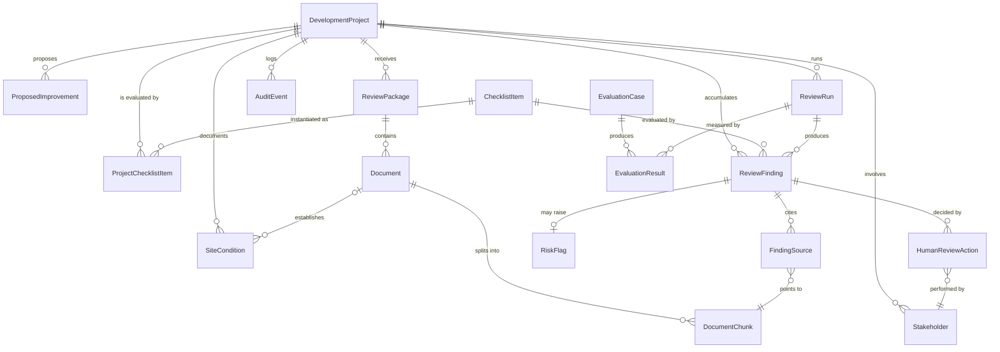

# Domain Model, Civil Engineer AI

**Product:** Civil Engineer AI: Stormwater Review Assistant
**Scope:** Core domain entities for v1 (stormwater) designed to extend to the
full land development platform.
**Audience:** The developer who will later turn this into a database schema and
API models (see `ARCHITECTURE.md` Section 6 for the table-level view).

> This document defines the conceptual domain. Field names use `snake_case` to
> map cleanly onto a PostgreSQL schema. Where the architecture brief already
> names a table, this model stays consistent with it. Multi-module concepts
> (e.g., `review_domain`) are introduced now so the schema does not need
> reshaping when grading, utilities, or roadway modules are added.

---

## 1. Entity Overview

| Entity | One-line purpose |
| --- | --- |
| `DevelopmentProject` | The land development project under review (Brookside Meadows). |
| `SiteCondition` | A documented existing-condition fact about the site. |
| `ProposedImprovement` | A proposed design element (basin, road, BMP, utility). |
| `Stakeholder` | A person or organization involved in the project. |
| `ReviewPackage` | A submission/resubmission of documents reviewed as a set. |
| `Document` | One submitted file in a review package. |
| `DocumentChunk` | A retrievable, source-linked text segment of a document. |
| `ChecklistItem` | A reusable review requirement (the structure of the review). |
| `ProjectChecklistItem` | The status of a checklist item for a specific project. |
| `ReviewRun` | One execution of the AI-assisted review pipeline. |
| `ReviewFinding` | An AI-drafted, source-cited review-support finding. |
| `FindingSource` | A link from a finding to the chunk/page that supports it. |
| `RiskFlag` | A reviewer-facing risk classification derived from findings. |
| `HumanReviewAction` | A human decision on a finding (accept/edit/reject/etc.). |
| `AuditEvent` | A traceability record of any significant system or human action. |
| `EvaluationCase` | A test fixture with expected findings for the pipeline. |
| `EvaluationResult` | The measured outcome of running an evaluation case. |

The bracketed `[future]` tag marks fields included now for platform growth that
v1 may leave null or constant.

---

## 2. Entity Definitions

### 2.1 DevelopmentProject

**Purpose.** The top-level container for everything reviewed about one land
development project.

**Key fields**

| Field | Type | Notes |
| --- | --- | --- |
| `project_id` | string/uuid | PK |
| `project_name` | string | "Brookside Meadows Residential Subdivision" |
| `project_type` | enum | `residential_subdivision`, `commercial_redevelopment`, … |
| `location_context` | string | "Suburban-fringe parcel, Town of Hartwell" |
| `jurisdiction` | string | "Town of Hartwell" |
| `review_type` | enum | `post_construction_stormwater`, `subdivision_site_plan`, … |
| `review_domain` | enum `[future]` | `stormwater` (v1); later `grading`, `roadway`, `utility`, … |
| `acreage` | decimal | 38.5 |
| `disturbed_area_acres` | decimal | ~22 |
| `proposed_lots` | int | 47 |
| `has_infiltration_practice` | bool | drives checklist applicability |
| `has_detention_basin` | bool | drives checklist applicability |
| `status` | enum | `intake` → … → `closed` (see Architecture 5.1) |
| `created_at` / `updated_at` | timestamp | |

**Relationships.** Has many `SiteCondition`, `ProposedImprovement`,
`Stakeholder`, `ReviewPackage`, `ProjectChecklistItem`, `ReviewRun`,
`ReviewFinding`, `AuditEvent`.

**Example**

```json
{
  "project_id": "proj_brookside_meadows",
  "project_name": "Brookside Meadows Residential Subdivision",
  "project_type": "residential_subdivision",
  "location_context": "Suburban-fringe former farm parcel, Town of Hartwell",
  "jurisdiction": "Town of Hartwell",
  "review_type": "subdivision_site_plan",
  "review_domain": "stormwater",
  "acreage": 38.5,
  "disturbed_area_acres": 22.0,
  "proposed_lots": 47,
  "has_infiltration_practice": true,
  "has_detention_basin": true,
  "status": "ready_for_review"
}
```

---

### 2.2 SiteCondition

**Purpose.** A documented existing-condition fact, used to justify checklist
applicability and to ground findings (e.g., seasonal high groundwater → the
infiltration/groundwater checklist item applies).

**Key fields**

| Field | Type | Notes |
| --- | --- | --- |
| `site_condition_id` | string/uuid | PK |
| `project_id` | fk | → DevelopmentProject |
| `condition_type` | enum | `soils`, `groundwater`, `wetland_buffer`, `stream`, `slope`, `downstream_structure`, `vegetation`, `adjacent_use` |
| `description` | text | "Seasonal high groundwater ~2.5 to 3.5 ft in SE meadow" |
| `source_document_id` | fk (nullable) | → Document that established the fact |
| `severity_hint` | enum (nullable) | `low` / `medium` / `high` |

**Relationships.** Belongs to a project; optionally references a `Document`;
referenced by `ChecklistItem.applies_when` logic.

**Example**

```json
{
  "site_condition_id": "site_ghw_01",
  "project_id": "proj_brookside_meadows",
  "condition_type": "groundwater",
  "description": "Soils report notes seasonal high groundwater ~2.5-3.5 ft below grade in the southeastern meadow.",
  "source_document_id": "doc_soils_report",
  "severity_hint": "high"
}
```

---

### 2.3 ProposedImprovement

**Purpose.** A proposed design element. Drives applicability (e.g., an
infiltration basin requires infiltration testing) and supports cross-document
consistency checks (e.g., basin naming).

**Key fields**

| Field | Type | Notes |
| --- | --- | --- |
| `improvement_id` | string/uuid | PK |
| `project_id` | fk | → DevelopmentProject |
| `improvement_type` | enum | `infiltration_basin`, `detention_basin`, `bioretention`, `storm_drain`, `outfall`, `road`, `cul_de_sac`, `sidewalk`, `water_main`, `sanitary_sewer`, `riprap_apron`, `construction_entrance` |
| `label` | string | Canonical label, e.g., "Basin 1" |
| `aliases` | string[] | Known alternate labels, e.g., ["Pond A"], supports naming-conflict detection |
| `review_domain` | enum `[future]` | `stormwater`, `roadway`, `utility`, … |
| `description` | text | |

**Relationships.** Belongs to a project; referenced by findings about
consistency and applicability.

**Example**

```json
{
  "improvement_id": "imp_basin1",
  "project_id": "proj_brookside_meadows",
  "improvement_type": "detention_basin",
  "label": "Basin 1",
  "aliases": ["Pond A"],
  "review_domain": "stormwater",
  "description": "Wet detention basin in the SE low area; peak-flow attenuation before the Quarry Road culvert."
}
```

---

### 2.4 Stakeholder

**Purpose.** A person/organization in the workflow. Supports attribution
(engineer of record, reviewer), routing (escalations), and future
comment-response tracking.

**Key fields**

| Field | Type | Notes |
| --- | --- | --- |
| `stakeholder_id` | string/uuid | PK |
| `project_id` | fk | → DevelopmentProject |
| `name` | string | "R. Alvarez, PE" |
| `organization` | string | "Town of Hartwell" |
| `role` | enum | `developer`, `engineer_of_record`, `planning_board`, `town_engineer`, `conservation_commission`, `dpw`, `fire_department`, `abutter`, `contractor`, `hoa_maintenance` |
| `is_reviewer` | bool | True for the human review user(s) |

**Relationships.** Belongs to a project; may be referenced by
`HumanReviewAction.reviewer_id` and (future) comment-response records.

---

### 2.5 ReviewPackage

**Purpose.** A versioned set of documents reviewed together, the unit of a
submission or resubmission. Lets the platform compare submission vs.
resubmission later.

**Key fields**

| Field | Type | Notes |
| --- | --- | --- |
| `package_id` | string/uuid | PK |
| `project_id` | fk | → DevelopmentProject |
| `submission_label` | string | "Initial Submission" / "Resubmission 1" |
| `received_at` | timestamp | |
| `is_current` | bool | The active package under review |

**Relationships.** Belongs to a project; has many `Document`; reviewed by
`ReviewRun`.

---

### 2.6 Document

**Purpose.** One submitted file. The unit of ingestion and the anchor for source
citation.

**Key fields**

| Field | Type | Notes |
| --- | --- | --- |
| `document_id` | string/uuid | PK |
| `project_id` | fk | → DevelopmentProject |
| `package_id` | fk | → ReviewPackage |
| `file_name` | string | "stormwater-management-report.pdf" |
| `document_type` | enum | see Architecture 5.2 list (drainage_report, soil_report, …) |
| `revision` | string | "initial" |
| `processing_status` | enum | `pending`, `processing`, `processed`, `processing_failed` |
| `storage_path` | string | local/synthetic path; never a real client plan |
| `uploaded_by` | string | |
| `created_at` | timestamp | |

**Relationships.** Belongs to a project and package; has many `DocumentChunk`;
referenced by `FindingSource` and `SiteCondition`.

---

### 2.7 DocumentChunk

**Purpose.** A retrievable text segment with enough metadata to trace any
AI statement back to a page and section. The atomic unit of retrieval.

**Key fields**

| Field | Type | Notes |
| --- | --- | --- |
| `chunk_id` | string/uuid | PK |
| `project_id` | fk | denormalized for fast project-scoped search |
| `document_id` | fk | → Document |
| `chunk_index` | int | order within document |
| `page_number` | int (nullable) | |
| `section_heading` | string (nullable) | "Proposed Drainage Conditions" |
| `content` | text | the chunk text |
| `embedding` | vector | pgvector; null until embedded |
| `token_count` | int | |
| `created_at` | timestamp | |

**Relationships.** Belongs to a document; referenced by `FindingSource`.

---

### 2.8 ChecklistItem

**Purpose.** A reusable, domain-agnostic review requirement. The checklist is
what makes the review structured rather than an open prompt.

**Key fields**

| Field | Type | Notes |
| --- | --- | --- |
| `checklist_item_id` | string/uuid | PK |
| `review_domain` | enum `[future]` | `stormwater` (v1); later other modules |
| `category` | string | "infiltration", "design_storm", "o_and_m", … |
| `requirement` | text | The review question / expectation |
| `expected_evidence` | string[] | What evidence would satisfy it |
| `supporting_document_types` | enum[] | Where that evidence usually lives |
| `applies_when` | json | Predicate over project flags / site conditions |
| `risk_level` | enum | `low` / `medium` / `high` |

**Relationships.** Reusable across projects; instantiated per project as
`ProjectChecklistItem`; referenced by `ReviewFinding`.

**Example**

```json
{
  "checklist_item_id": "chk_infiltration_testing",
  "review_domain": "stormwater",
  "category": "infiltration",
  "requirement": "If an infiltration practice is proposed, the package should include field infiltration testing (locations, rates, method, date) and groundwater separation.",
  "expected_evidence": ["infiltration_test_rate", "test_location", "test_date", "groundwater_separation"],
  "supporting_document_types": ["soil_report", "infiltration_testing_documentation", "stormwater_management_report"],
  "applies_when": { "has_infiltration_practice": true },
  "risk_level": "high"
}
```

---

### 2.9 ProjectChecklistItem

**Purpose.** The per-project status of a checklist item, separates the reusable
requirement from this project's evaluated result.

**Key fields**

| Field | Type | Notes |
| --- | --- | --- |
| `project_checklist_item_id` | string/uuid | PK |
| `project_id` | fk | → DevelopmentProject |
| `checklist_item_id` | fk | → ChecklistItem |
| `status` | enum | `not_started`, `supported`, `missing`, `conflicting`, `unclear`, `not_applicable`, `requires_human_review` |
| `assigned_reviewer_id` | fk (nullable) | → Stakeholder |
| `updated_at` | timestamp | |

**Relationships.** Joins project ↔ checklist item; referenced by findings.

---

### 2.10 ReviewRun

**Purpose.** One execution of the review pipeline. Anchors prompt-version and
model metadata for reproducibility and evaluation.

**Key fields**

| Field | Type | Notes |
| --- | --- | --- |
| `review_run_id` | string/uuid | PK |
| `project_id` | fk | → DevelopmentProject |
| `package_id` | fk | → ReviewPackage |
| `run_type` | enum | `full_checklist`, `single_item`, `evaluation` |
| `status` | enum | `running`, `completed`, `failed` |
| `model_provider` | string | |
| `model_name` | string | |
| `prompt_version` | string | "review_finding_v1" |
| `started_at` / `completed_at` | timestamp | |

**Relationships.** Belongs to a project/package; produces many `ReviewFinding`;
referenced by `EvaluationResult`.

---

### 2.11 ReviewFinding

**Purpose.** The core output: an AI-drafted, source-cited, review-support
finding tied to a checklist item. Always draft until a human acts on it.

**Key fields**

| Field | Type | Notes |
| --- | --- | --- |
| `finding_id` | string/uuid | PK |
| `project_id` | fk | → DevelopmentProject |
| `review_run_id` | fk | → ReviewRun |
| `checklist_item_id` | fk | → ChecklistItem |
| `finding_type` | enum | `missing_evidence`, `conflicting_information`, `unresolved_issue`, `unclear_information`, `supported_evidence` |
| `title` | string | "Infiltration testing evidence not found" |
| `summary` | text | Source-grounded explanation (safe wording only) |
| `status` | enum | same status vocabulary as ProjectChecklistItem |
| `risk_level` | enum | `low` / `medium` / `high` |
| `confidence` | decimal | 0 to 1, AI self-reported, treated as advisory |
| `recommended_action` | text | Draft reviewer follow-up |
| `human_review_state` | enum | `pending`, `accepted`, `edited`, `rejected`, `escalated` |
| `created_at` | timestamp | |

**Relationships.** Belongs to project/run/checklist item; has many
`FindingSource`; has one `RiskFlag` (optional); has many `HumanReviewAction`.

**Example**, see `ARCHITECTURE.md` Section 5.6 for the full JSON finding
schema, including the `safety_boundary_check` block.

---

### 2.12 FindingSource

**Purpose.** The evidence link that makes a finding traceable. A finding that
uses evidence must have at least one source.

**Key fields**

| Field | Type | Notes |
| --- | --- | --- |
| `finding_source_id` | string/uuid | PK |
| `finding_id` | fk | → ReviewFinding |
| `document_id` | fk | → Document |
| `chunk_id` | fk | → DocumentChunk |
| `page_number` | int (nullable) | |
| `excerpt` | text | the cited text |

**Relationships.** Belongs to a finding; references a document and chunk.

---

### 2.13 RiskFlag

**Purpose.** A reviewer-facing risk classification derived from a finding,
used for dashboards, heatmaps, and prioritization.

**Key fields**

| Field | Type | Notes |
| --- | --- | --- |
| `risk_flag_id` | string/uuid | PK |
| `finding_id` | fk | → ReviewFinding |
| `risk_category` | enum | `missing_infiltration_testing`, `mismatched_storm_event`, `missing_downstream_capacity`, `missing_oem_owner`, `unresolved_rfi`, `inspection_without_corrective_action`, `conflicting_document_reference`, `missing_revised_sheet`, … |
| `risk_level` | enum | `low` / `medium` / `high` |
| `reason` | text | |
| `review_status` | enum | `pending`, `resolved`, `dismissed` |

**Relationships.** Belongs to a finding; aggregated for risk heatmaps `[future]`.

---

### 2.14 HumanReviewAction

**Purpose.** The recorded human decision on a finding, the heart of
human-in-the-loop. No finding is final without one.

**Key fields**

| Field | Type | Notes |
| --- | --- | --- |
| `review_action_id` | string/uuid | PK |
| `finding_id` | fk | → ReviewFinding |
| `reviewer_id` | fk | → Stakeholder |
| `action` | enum | `accepted`, `edited`, `rejected`, `escalated`, `marked_unclear`, `requested_more_information` |
| `reviewer_note` | text | |
| `edited_summary` | text (nullable) | when action = edited |
| `created_at` | timestamp | |

**Relationships.** Belongs to a finding; performed by a stakeholder; emits an
`AuditEvent`.

---

### 2.15 AuditEvent

**Purpose.** The traceability spine. Every significant system or human action is
logged so any finding can be reconstructed end to end.

**Key fields**

| Field | Type | Notes |
| --- | --- | --- |
| `audit_event_id` | string/uuid | PK |
| `project_id` | fk | → DevelopmentProject |
| `event_type` | enum | `document_uploaded`, `document_processed`, `chunks_created`, `retrieval_query`, `model_called`, `finding_generated`, `finding_validation_failed`, `human_review_action`, `evaluation_run`, `error` |
| `actor_type` | enum | `system`, `human` |
| `actor_id` | string (nullable) | reviewer/stakeholder when human |
| `entity_type` | string | "finding", "document", "review_run", … |
| `entity_id` | string | |
| `metadata` | json | prompt_version, model_name, retrieved_chunk_ids, etc. |
| `created_at` | timestamp | |

**Relationships.** Belongs to a project; references any entity by
`entity_type`/`entity_id`.

---

### 2.16 EvaluationCase

**Purpose.** A test fixture: a project package (or subset) plus the findings the
pipeline is expected to produce. Turns "it seems to work" into a measurable
claim.

**Key fields**

| Field | Type | Notes |
| --- | --- | --- |
| `eval_case_id` | string/uuid | PK |
| `name` | string | "Missing infiltration testing evidence" |
| `description` | text | |
| `project_fixture` | string | seed fixture id |
| `input_documents` | string[] | document ids/types provided to the case |
| `expected_findings` | json[] | expected checklist item, status, risk, evidence |
| `expected_risk_level` | enum | dominant expected risk |
| `evaluation_metric` | enum | `recall`, `precision`, `source_citation_accuracy`, `no_false_positive`, `no_prohibited_wording` |

**Relationships.** Produces many `EvaluationResult` over time.

---

### 2.17 EvaluationResult

**Purpose.** The measured outcome of running an evaluation case against a review
run, the metrics shown on the evaluation dashboard.

**Key fields**

| Field | Type | Notes |
| --- | --- | --- |
| `eval_result_id` | string/uuid | PK |
| `eval_case_id` | fk | → EvaluationCase |
| `review_run_id` | fk | → ReviewRun |
| `checklist_recall` | decimal | |
| `checklist_precision` | decimal | |
| `source_citation_accuracy` | decimal | |
| `false_positives` | int | |
| `false_negatives` | int | |
| `unsupported_claims` | int | |
| `prohibited_wording_count` | int | should be 0 |
| `passed` | bool | against the case's pass criteria |
| `created_at` | timestamp | |

**Relationships.** Belongs to an evaluation case and a review run.

---

## 3. Entity Relationship Diagram



---

## 4. Status Vocabulary (Enforced Everywhere)

To keep the professional boundary intact, these are the **only** status values
used for checklist items and findings:

`supported` · `missing` · `conflicting` · `unclear` · `not_applicable` ·
`requires_human_review` (plus `not_started` for an un-evaluated
`ProjectChecklistItem`).

**Never** use `approved`, `certified`, `compliant`, `passes`, or `safe` as a
status. This is asserted in AI output validation (Architecture Section 11) and
checked by an evaluation metric (`prohibited_wording_count`).

---

## 5. Notes for the Future Schema Step

- The v1 tables in `ARCHITECTURE.md` Section 6 are a faithful subset of this
  model. `SiteCondition`, `ProposedImprovement`, `Stakeholder`, `ReviewPackage`,
  and `RiskFlag` are added here to support the broader platform and the
  consistency/applicability checks; v1 may seed them but keep their UI light.
- `review_domain` on `ChecklistItem`, `ProposedImprovement`, and
  `DevelopmentProject` is the single most important "future-proofing" field: it
  lets grading/utility/roadway modules reuse the same tables.
- `aliases` on `ProposedImprovement` is what makes the "Pond A vs. Basin 1"
  naming-conflict finding (I-9) detectable without bespoke code.
