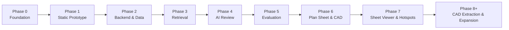

# Roadmap, Civil Engineer AI

**Product:** Civil Engineer AI: Stormwater Review Assistant

This roadmap shows the staged path from a documentation foundation to a
multi-module land development review platform. **Stormwater is the starting
point, not the endpoint.** Each phase delivers something demonstrable, and no
phase begins until the previous one's foundation is solid.

---

## Phase 0, Foundation  *(this phase)*

**Goal:** Build the strongest possible foundation before any code.

- Research basis (`RESEARCH_AND_SYSTEM_DESIGN.md`)
- Project story (`BROOKSIDE_MEADOWS_PROJECT_STORY.md`)
- Domain model (`DOMAIN_MODEL.md`)
- Safety boundaries (`PHASE_0_FOUNDATION.md` §4; existing safety content)
- V1 scope (`V1_SCOPE.md`)
- Seed data plan (`SEED_DATA_PLAN.md`)

**Exit criteria:** Phase 0 documents reviewed and approved. No application code
written. (See `PHASE_0_FOUNDATION.md` §9.)

---

## Phase 1, Static Portfolio Prototype

**Goal:** A clickable, convincing UI driven entirely by seed data, no AI calls.

- Next.js + TypeScript frontend
- Seeded Brookside Meadows project data (from `SEED_DATA_PLAN.md`)
- Static document library
- Static checklist view (statuses precomputed from seed data)
- Static findings list and finding detail pages
- Static human review queue (actions stubbed/local)
- Static audit trail view
- Use the canonical product naming (**Civil Engineer AI**) and demo fixture
  (**Brookside Meadows**) consistently across the app and docs

**Why first:** It de-risks the product story and UX, and gives a portfolio-ready
artifact early, before any backend or model cost.

**Exit criteria:** A reviewer can navigate the full v1 loop visually with seeded
content.

---

## Phase 2, Backend and Data Model

**Goal:** Make the seeded data real and queryable.

- FastAPI backend
- PostgreSQL (or Supabase) with the schema from `DOMAIN_MODEL.md` /
  `ARCHITECTURE.md` §6
- Seed scripts loading project, documents, checklist, findings, audit events
- Read/write API endpoints for projects, documents, checklist, findings,
  review actions, audit events (per `ARCHITECTURE.md` §8)
- Wire the Phase 1 frontend to live endpoints

**Exit criteria:** The static prototype now runs on a real database and API.

---

## Phase 3, Retrieval Layer

**Goal:** Turn documents into source-linked, retrievable evidence.

- Document chunking with page/section metadata
- Embeddings + pgvector storage
- Hybrid retrieval (semantic + keyword) scoped by project, document type, and
  checklist category
- Source-evidence search surfaced in the UI ("view source")
- Retrieval testing: weak-result rejection, ranking sanity checks

**Exit criteria:** For any checklist item, the system returns ranked, cited
evidence chunks from the Brookside Meadows package.

**Delivered in Phase 3:** the document chunk and finding source data model,
seeded chunks and source evidence, and keyword and metadata retrieval with
checklist and finding evidence endpoints and frontend evidence display.
Embeddings, a vector store, and semantic retrieval are deferred to a later step
behind the same retrieval interface. See `PHASE_3_RETRIEVAL_FOUNDATION.md`.

---

## Phase 4, AI Review Assistant

**Goal:** Generate structured, safe, source-cited findings.

- Structured, versioned prompts (per `ARCHITECTURE.md` §10)
- JSON output schema + validation (per `ARCHITECTURE.md` §11)
- Finding generation tied to checklist items and retrieved evidence
- Safety/prohibited-wording checks; `requires_human_review` on uncertainty
- **Human review required for every finding** before it is final

**Exit criteria:** Running the checklist produces validated findings that cite
sources, avoid prohibited wording, and land in the human review queue.

**Delivered in Phase 4:** a constrained AI review service, a provider
abstraction with a deterministic mock provider (default) and an optional live
provider (disabled by default), evidence-first prompts, strict JSON schema
validation, prohibited-word and citation safety checks, `ai_review_runs` and
`ai_draft_findings` tables, audit events for every step, an AI Review page, and
mandatory human review for every draft finding. A persisted human review queue
and live evaluation scoring are deferred to Phase 5. See
`PHASE_4_AI_REVIEW_ASSISTANT.md`.

---

## Phase 5, Human Review Queue and Evaluation System

**Goal:** Prove the system works, manage a full review lifecycle, and keep it
from regressing.

- Persisted human review actions on AI draft findings
- Human review queue with status transitions
- Recall / precision against expected findings
- Source-citation validity tracking
- Validation-failure, safety-failure, and prohibited-wording checks
- Evaluation result storage and an evaluation dashboard

**Exit criteria:** Draft findings move through a persisted human review queue
with audit events, and evaluation scoring runs against a real AI review run and
reports recall, precision, citation validity, and quality metrics for the
planted Brookside Meadows issues.

**Delivered in Phase 5:** persisted human review actions (`human_review_actions`)
with allowed actions (accept, edit, reject, escalate, mark unclear, request more
information) and review-support status transitions, a Human Review page,
evaluation scoring (`ai_evaluation_results` and `ai_evaluation_matches`) with
recall, precision, citation validity, human-review-required rate, and validation
and safety failure counts, evaluation dashboard updates, separate surfacing of
failed drafts, audit events for every review action and evaluation run, and
backend tests. There is no action called approve, and failed drafts cannot be
accepted. See `PHASE_5_HUMAN_REVIEW_AND_EVALUATION.md`.

> Phases 1 to 5 together constitute the **v1 build** defined in `V1_SCOPE.md`.

---

## Phase 6, Plan Sheet and CAD-Aware Review Foundation

**Goal:** Begin the transition from document-only review into plan sheet and
CAD-aware review support, without attempting full CAD parsing.

- Plan sheet data model and a seeded Brookside Meadows plan sheet index
- CAD-aware civil feature metadata, seeded rather than extracted
- Plan references connecting documents, sheets, and features
- Missing sheet detection and plan consistency findings that require human review
- Plan Sheets and CAD Review frontend pages
- Audit events for the plan consistency check

**Exit criteria:** The plan sheet index, CAD-aware metadata, plan references, and
plan consistency findings are seeded and served through the API, the consistency
check generates findings with audit events, and the frontend Plan Sheets and CAD
Review pages render. The CAD-aware metadata is seeded, not extracted from real
CAD files, and no DWG or DXF parsing, CAD verification, or final design review is
included.

**Delivered in Phase 6:** the `plan_sheets`, `cad_metadata`, `plan_references`,
and `plan_consistency_findings` tables, seeded Brookside Meadows plan data
(twelve sheets including the referenced-not-included C-3.1, sixteen CAD-aware
feature records, eleven plan references, and six plan consistency findings), the
plan sheet, CAD metadata, plan reference, and plan consistency endpoints, the
Plan Sheets and CAD Review pages, audit events for the consistency check, and
backend tests. See `PHASE_6_PLAN_SHEET_CAD_FOUNDATION.md` and
`CAD_INTEGRATION_ROADMAP.md`.

---

## Phase 7, Plan Sheet Viewer and Sheet Hotspot Review

**Goal:** Give reviewers a plan sheet viewer with seeded hotspot annotations on
top of the Phase 6 foundation, without parsing real PDF or CAD files.

- A plan sheet hotspot model with percentage coordinates and links to Phase 6
  entities
- A sheet viewer context that bundles a sheet with its hotspots and related
  evidence
- Human review actions on plan consistency findings (needs follow up, reviewer
  confirmed, not applicable, needs more information)
- A reviewer-facing Sheet Viewer with a synthetic preview, hotspot overlay, and
  review panels
- Audit events for viewer context requests, hotspot inspection, and plan review
  actions

**Exit criteria:** A reviewer can open a Brookside Meadows sheet, see seeded
hotspots over a synthetic preview, inspect connected evidence, and record
review-support actions on plan consistency findings. The preview and hotspots
are seeded review-support metadata, not parsed PDF, DWG, DXF, or Autodesk data.

**Delivered in Phase 7:** the `plan_sheet_hotspots` and
`plan_consistency_review_actions` tables, eight seeded hotspots across six
Brookside Meadows sheets, sheet hotspot, sheet viewer context, and plan review
action endpoints, the Sheet Viewer pages and viewer components, audit events,
and backend tests. There is no action called approve, and nothing verifies CAD
or validates a design. See `PHASE_7_PLAN_SHEET_VIEWER.md` and
`CAD_INTEGRATION_ROADMAP.md`.

---

## Phase 8 and beyond, CAD Extraction and Expansion Modules

**Goal:** Begin reading real CAD-derived metadata (DXF extraction or structured
plan exports, then Autodesk viewer exploration, per
`CAD_INTEGRATION_ROADMAP.md`) and reuse the engine to grow from a stormwater
assistant into a land development review platform. Each review module mostly
adds **checklist content, document types, and evaluation cases**, not new
infrastructure.

Future expansion areas:

- **Grading review assistant**, cut/fill balance evidence, slope stability
  references, phased earthwork.
- **Utility coordination review assistant**, water/sewer/storm crossings,
  pump-station documentation, conflict checks.
- **Roadway layout review assistant**, geometry, sight distance, sidewalk and
  fire-access checks.
- **Construction phasing review assistant**, sequencing dependencies and
  stabilization timing.
- **Municipal comment-response assistant**, track comments and draft response
  letters.
- **Inspection closeout assistant**, corrective-action tracking to closeout.
- **RFI resolution assistant**, open/closed RFI tracking and follow-up.
- **Cost and maintenance planning assistant**, long-term O&M responsibility and
  funding.
- **Climate resilience scenario assistant**, design-storm sensitivity and
  nature-based-solution scenarios.

**Cross-cutting platform capabilities (enabled by the Phase 0 model):**

- Evidence graphs linking findings ↔ documents ↔ checklist items ↔ stakeholders
  ↔ risks
- Risk heatmaps across the development package
- Development timeline tracking from planning review to construction closeout
- Multi-agent review roles (stormwater / grading / utility / municipal
  reviewers)
- Scenario comparison (conventional detention vs. green infrastructure)
- Review confidence scoring, prompt regression testing, citation-accuracy
  tracking, and reviewer-disagreement tracking

**The roadmap's message:** the same retrieval + checklist + findings + review +
audit + evaluation backbone that powers stormwater review in v1 powers every
later module. Brookside Meadows was deliberately authored (see its story §8) to
carry all of these forward without new seed storytelling.
