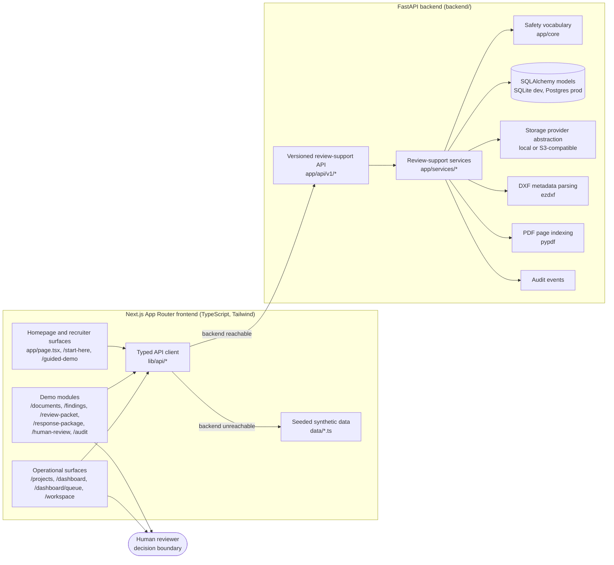

# Architecture Overview

This is the current-state architecture of Civil Engineer AI for technical reviewers. It describes what is running in the repository today. The original design brief lives in [ARCHITECTURE.md](ARCHITECTURE.md); this document reflects what was actually built.

Civil Engineer AI is a review-support and evidence-organization system. A human reviewer stays in control of every decision, and a licensed Professional Engineer remains responsible for any final engineering decision.

## How the pieces fit

- The frontend is a Next.js App Router application. Public demo surfaces run without a login and read the seeded Brookside Meadows fixture. Operational surfaces such as real projects and the reviewer queue require sign-in and per-project access control.
- The typed API client in `lib/api/` calls the FastAPI backend at `/api/v1/...`. When the backend is unreachable, the client falls back to the seeded data in `data/`, so the public demo keeps working.
- The backend owns the real data model: project intake, document registration, PDF page indexing, page-level evidence citations, deterministic evidence retrieval, checklist review with rule packs, applicant response matrix, resubmittal rounds, response packages with comment letter drafts, reviewer queue metrics, and audit events.
- DXF support parses metadata (layers, entities, blocks, text, reference candidates) with the ezdxf library. PDF support indexes the text layer of digital PDFs with pypdf.
- The safety vocabulary in `backend/app/core` constrains status and action wording to review-support language, and tests keep it that way.
- Every workflow ends at the human reviewer. There is no approve action anywhere in the system.

## Technical Review Notes

### What is implemented

- FastAPI backend with a versioned API, SQLAlchemy models, Alembic migrations, local authentication, organizations, roles, and per-project access control.
- Real DXF metadata parsing (ezdxf) and PDF text-layer page indexing (pypdf).
- Deterministic, local evidence retrieval with page-level citations. No live AI calls.
- Applicant response matrix, resubmittal rounds, response package issuance, and comment letter drafts.
- Reviewer dashboard and queue metrics filtered by access control.
- Durable storage abstraction with local storage for development and S3-compatible object storage for deployment.
- Audit trail for reviewer actions.
- Two-service Railway deployment with health and readiness diagnostics, plus CI (backend pytest with a coverage floor, frontend typecheck, lint, and vitest).

### What is seeded or simulated

- Brookside Meadows and the other demo project names are synthetic fixtures. See [synthetic-demo-data.md](synthetic-demo-data.md).
- The homepage KPI numbers and dashboard widgets are static demo values chosen for a stable recruiter-facing snapshot.
- AI guidance is illustrative. Live AI calls are disabled by default and the demo runs deterministically with a mock provider.

### What is intentionally out of scope

- OCR, DWG parsing, CAD geometry validation, GIS integration, computer vision, and vector search.
- Enterprise single sign-on and a full applicant portal.
- Any final approval, certification, or compliance determination. Those stay with a licensed Professional Engineer.

### Where to inspect the code first

1. `lib/api/client.ts` and one module such as `lib/api/findings.ts` for the client and fallback pattern.
2. `backend/app/services/` for the capability-per-service layout.
3. `backend/app/core/` for the safety vocabulary.
4. `app/__tests__/homepage.test.tsx` and `lib/api/__tests__/` for the content-contract testing style.
5. [real-vs-mocked.md](real-vs-mocked.md) for the full capability-by-capability status map.
